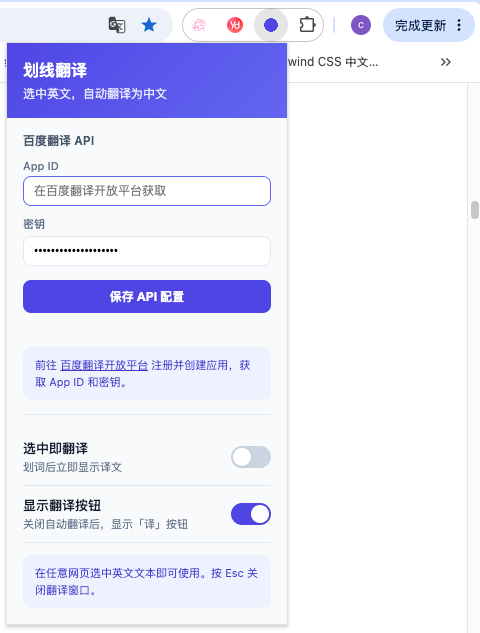
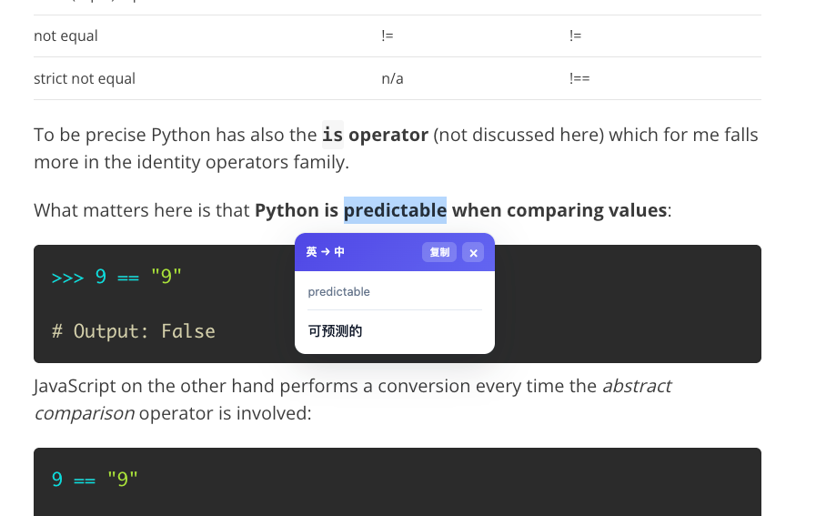
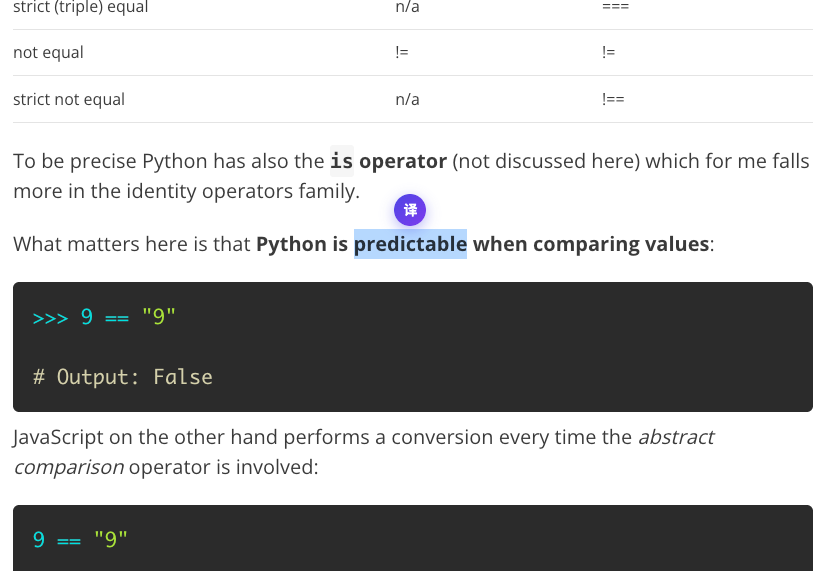

# 划线翻译

一个轻量级 Chrome 浏览器扩展，选中网页中的英文文本即可自动翻译为中文。基于百度翻译 API，即开即用。

## 预览

### 设置面板

点击扩展图标，配置百度翻译 API 密钥及功能开关。



### 划词自动翻译

开启「选中即翻译」后，选中英文文本即可自动弹出译文。



### 翻译按钮模式

关闭自动翻译后，选中文本会显示「译」按钮，点击后显示译文。



## 功能

- **划词翻译** — 在任意网页选中英文文本，自动弹出翻译结果
- **翻译按钮** — 关闭自动翻译后，选中文本会显示「译」浮动按钮，点击触发翻译
- **一键复制** — 翻译弹窗内支持一键复制译文到剪贴板
- **百度翻译 API** — 使用百度翻译开放平台，翻译质量高
- **翻译缓存** — 内置 LRU 缓存（最多 200 条），相同文本不重复请求
- **快捷键关闭** — 按 `Esc` 键即可关闭翻译弹窗
- **滚动自动隐藏** — 页面滚动时自动收起翻译弹窗，不遮挡阅读

## 安装

1. 克隆或下载本项目到本地
2. 打开 Chrome 浏览器，进入 `chrome://extensions/`
3. 开启右上角的「开发者模式」
4. 点击「加载已解压的扩展程序」，选择项目根目录
5. 扩展安装完成，工具栏会出现扩展图标

## 使用

### 获取百度翻译 API 密钥

使用前需要先获取百度翻译 API 的 App ID 和密钥：

1. 前往百度翻译开放平台
2. 注册账号并创建应用
3. 开通「通用翻译 API」服务
4. 在「管理控制台」获取 **App ID** 和**密钥**

### 配置扩展

1. 点击浏览器工具栏的扩展图标，打开设置面板
2. 填入百度翻译 API 的 **App ID** 和**密钥**，点击「保存 API 配置」
3. 根据需要开启或关闭以下选项：
   - **选中即翻译**：划词后立即显示译文
   - **显示翻译按钮**：关闭自动翻译后，选中文本时显示「译」按钮

### 翻译文本

- 在任意网页中用鼠标选中英文文本，即可看到翻译结果
- 翻译弹窗中点击「复制」可将译文复制到剪贴板
- 按 `Esc` 键或滚动页面可关闭弹窗

## 项目结构

```
ai-trans/
├── manifest.json     # Chrome 扩展清单 (Manifest V3)
├── background.js     # Service Worker — 调用百度翻译 API，管理缓存
├── content.js        # 内容脚本 — 注入页面，处理划词交互与弹窗
├── content.css       # 内容脚本样式 — 翻译弹窗与触发按钮样式
├── popup.html        # 扩展弹出页面 — API 配置与选项设置
├── popup.js          # 弹出页面逻辑 — 读写 chrome.storage
├── js-sdk/
│   ├── md5.js        # MD5 签名库 — 百度 API 签名计算所需
│   └── index.html    # MD5 测试页面
└── icons/            # 扩展图标 (16/48/128 px)
```

## 技术实现

- **Manifest V3** — 使用最新的 Chrome 扩展平台标准
- **Service Worker** — 翻译请求在后台脚本中完成，不阻塞页面
- **百度翻译 API 签名** — 使用 MD5 算法生成 `appid + text + salt + secretKey` 签名
- **LRU 缓存** — Service Worker 侧维护 Map 缓存，翻译过的文本不重复请求
- **chrome.storage.sync** — 用户配置（API 密钥、选项）通过 Chrome 同步存储保存

## 许可

MIT
